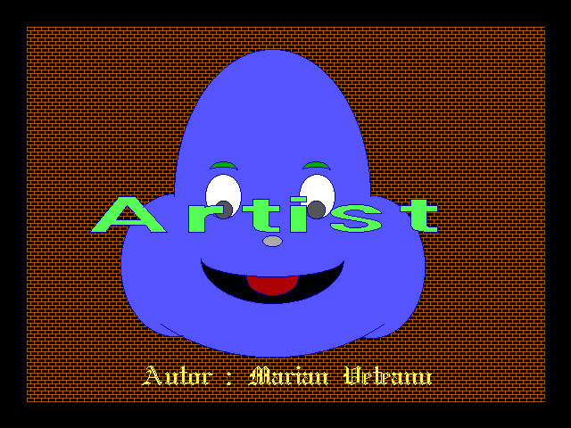
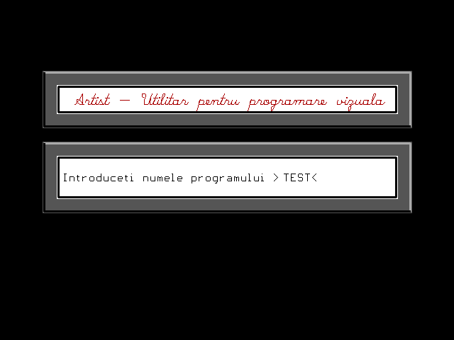
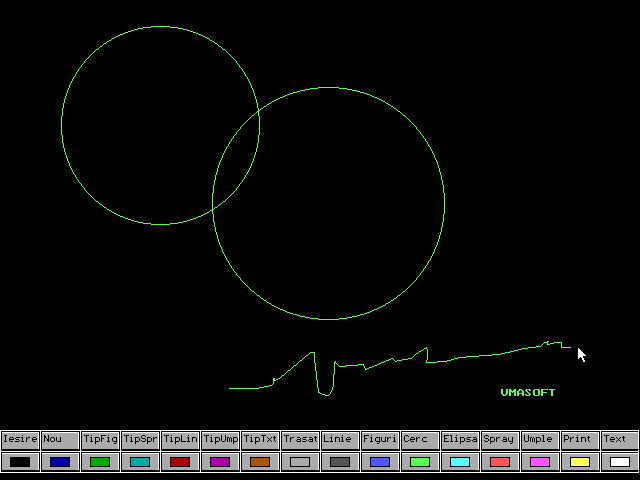

Artist
======

Last update: 1996

PC-DOS based graphics editor that generates Pascal source code of what user is drawing.
Software was inteded to be used by new students learning BGI graphics.
Software requires Borland Pascal for compilation. 

Screencast
----------

- [http://www.vmasoft.net/artist.html](http://www.vmasoft.net/artist.html)

Screenshots
-----------

